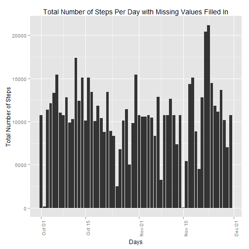
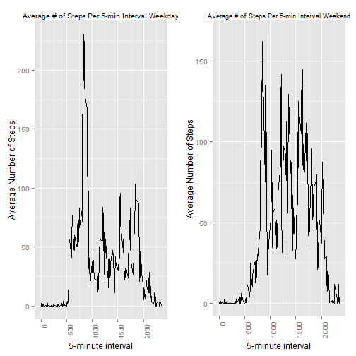

##Objective

This assignment focuses on data captured in October and November, 2012 from a personal activity monitoring device. 

##Dataset

The dataset has three variables:

* steps: Number of steps taking in a 5-minute interval (missing values are coded as NA)

* date: The date on which the measurement was taken in YYYY-MM-DD format

* interval: Identifier for the 5-minute interval in which measurement was taken


```r
file_name <- "activity.csv"  #file name of dataset
data <- read.csv(file_name,header=TRUE)

library(xtable)
xt <- xtable(summary(data))
print(xt, type="html")
```

<!-- html table generated in R 3.1.2 by xtable 1.7-4 package -->
<!-- Fri Feb 13 18:32:55 2015 -->
<table border=1>
<tr> <th>  </th> <th>     steps </th> <th>         date </th> <th>    interval </th>  </tr>
  <tr> <td align="right"> 1 </td> <td> Min.   :  0.00   </td> <td> 2012-10-01:  288   </td> <td> Min.   :   0.0   </td> </tr>
  <tr> <td align="right"> 2 </td> <td> 1st Qu.:  0.00   </td> <td> 2012-10-02:  288   </td> <td> 1st Qu.: 588.8   </td> </tr>
  <tr> <td align="right"> 3 </td> <td> Median :  0.00   </td> <td> 2012-10-03:  288   </td> <td> Median :1177.5   </td> </tr>
  <tr> <td align="right"> 4 </td> <td> Mean   : 37.38   </td> <td> 2012-10-04:  288   </td> <td> Mean   :1177.5   </td> </tr>
  <tr> <td align="right"> 5 </td> <td> 3rd Qu.: 12.00   </td> <td> 2012-10-05:  288   </td> <td> 3rd Qu.:1766.2   </td> </tr>
  <tr> <td align="right"> 6 </td> <td> Max.   :806.00   </td> <td> 2012-10-06:  288   </td> <td> Max.   :2355.0   </td> </tr>
  <tr> <td align="right"> 7 </td> <td> NA's   :2304   </td> <td> (Other)   :15840   </td> <td>  </td> </tr>
   </table>
##

The summary table of the dataset shows there are 2304 5-minute intervals missing the number of steps taken.  The impact of these missing values will be reviewed later in this assignment.

##Analysis

By keeping the missing values in the dataset, the total number of steps taken per day can be calculated..


```r
total_num_steps_per_day <- sapply(unique(data$date),FUN = function(X) sum(data$steps[data$date==X],na.rm=TRUE))

df <- data.frame(total_num_steps_per_day,unique(data$date))
names(df)[1]<-paste("total_num_steps_per_day")
names(df)[2]<-paste("date")

library(ggplot2)

total_plot <- ggplot(df,aes(x=as.Date(df$date),y=df$total_num_steps_per_day)) 
total_plot <- total_plot + geom_bar(stat ="identity") + theme(axis.text.x = element_text(angle = 90, hjust = 1,size=8)) 
total_plot <- total_plot + labs(title="Total Number of Steps Per Day") + labs(x="Days") + labs(y="Total Number of Steps")

total_plot
```

 

The following calculation shows the mean and median of the total number of steps taken per day.


```r
mean_steps <- mean(total_num_steps_per_day,na.rm=TRUE)
median_steps <- median(total_num_steps_per_day,na.rm=TRUE)
print(mean_steps)
```

```
## [1] 9354.23
```

```r
print(median_steps)
```

```
## [1] 10395
```


The following calculation can be used to determine the average number of steps taken per day.


```r
ave_num_steps_per_interval <- sapply(unique(data$interval),FUN = function(X) mean(data$steps[data$interval==X],na.rm=TRUE))

df <- data.frame(ave_num_steps_per_interval,unique(data$interval))
names(df)[1]<-paste("ave_num_steps_per_interval")
names(df)[2]<-paste("interval")

ave_plot <- ggplot(data=df,aes(x=interval,y=ave_num_steps_per_interval),group=1) + geom_line()
ave_plot <- ave_plot + theme(axis.text.x = element_text(angle = 90, hjust = 1,size=8)) + geom_line()
ave_plot <- ave_plot + labs(title="Average Number of Steps Per 5-minute Interval") + labs(x="5-minute interval") + labs(y="Average Number of Steps")

ave_plot
```

 

The maximum average number of steps in a 5-minute interval can be found using the max R function.


```r
Interval_with_Max <- df$interval[which.max(df$ave_num_steps_per_interval)]  
max_ave_num_steps <- max(df$ave_num_steps_per_interval)  

print(Interval_with_Max) #Interval with maximum average number of steps
```

```
## [1] 835
```

```r
print(max_ave_num_steps) #maximum average number of steps in a 5-minute interval
```

```
## [1] 206.1698
```

##Imputing Missing Values

There are 2304 missing values (NA) in the steps column of the data set as shown in the dataset summary table.  Using the average number of steps for a particular 5-minute interval, the missing values can be filled in.  The following R code copies the original dataset and loops through it filling in the missing values with the average number of steps for a particular 5-minute interval.


```r
new_data <- data    #copy original dataset
for (i in 1:dim(new_data)[1])
    {
        if (is.na(new_data$steps[i]))
            {
                new_data$steps[i] <- df$ave_num_steps_per_interval[df$interval==new_data$interval[i]]
            }
    }
```

A similar histogram, mean and median analysis can be performed on this dataset with the missing values filled in.


```r
total_num_steps_per_day <- sapply(unique(new_data$date),FUN = function(X) sum(new_data$steps[new_data$date==X],na.rm=TRUE))

df <- data.frame(total_num_steps_per_day,unique(new_data$date))
names(df)[1]<-paste("total_num_steps_per_day")
names(df)[2]<-paste("date")

library(ggplot2)

total_plot <- ggplot(df,aes(x=as.Date(df$date),y=df$total_num_steps_per_day)) 
total_plot <- total_plot + geom_bar(stat ="identity") + theme(axis.text.x = element_text(angle = 90, hjust = 1,size=8)) 
total_plot <- total_plot + labs(title="Total Number of Steps Per Day with Missing Values Filled In") + labs(x="Days") + labs(y="Total Number of Steps")

total_plot
```

 

```r
mean_steps <- mean(total_num_steps_per_day,na.rm=TRUE)
median_steps <- median(total_num_steps_per_day,na.rm=TRUE)
print(mean_steps)
```

```
## [1] 10766.19
```

```r
print(median_steps)
```

```
## [1] 10766.19
```

The mean and median of the original dataset was 9354.23 and 10395 respectively, while the new dataset with missing values filled in was 10766.19 for both mean and median. Imputing the data increased the mean and median due to the fact that there is more data present in the total daily number of steps.

##Weekdays and Weekends

A person's activity level may change depending if it is a weekend or weekday.  This difference can be viewed by separating the weekend and weekdays from the dataset (the filled-in missing value dataset) by adding a new variable to the dataset with two levels (weekend and weekday).  Then this variable can be populated using the is.weekend function.  Once the days have been classified, a plot of the 5-minute interval vs average number of steps taken for both weekdays and weekends can be compared.


```r
new_data$days <- factor(c("weekday","weekend")) #create factor with levels: weekend and weekday

library(chron)

#determine if date is a weekday or weekend
for (i in 1:dim(new_data)[1]) {
    if (is.weekend(new_data$date[i])){
        new_data$days[i] <- "weekend"
    } else new_data$days[i] <- "weekday"
}

ave_num_steps_per_interval_weekday <- sapply(unique(new_data$interval),FUN = function(X) mean(new_data$steps[data$interval==X & new_data$days=="weekday"]))

ave_num_steps_per_interval_weekend <- sapply(unique(data$interval),FUN = function(X) mean(new_data$steps[data$interval==X & new_data$days=="weekend"]))

df <- data.frame(ave_num_steps_per_interval_weekend,ave_num_steps_per_interval_weekday,unique(data$interval))
names(df)[1]<-paste("ave_num_steps_per_interval_weekend")
names(df)[2]<-paste("ave_num_steps_per_interval_weekday")
names(df)[3]<-paste("interval")

library(gridExtra)
```

```
## Loading required package: grid
```

```r
ave_plot_weekend <- ggplot(data=df,aes(x=interval,y=ave_num_steps_per_interval_weekend),group=1) + geom_line()
ave_plot_weekend <- ave_plot_weekend + theme(axis.text.x = element_text(angle = 90, hjust = 1,size=6)) + geom_line() 
ave_plot_weekend <- ave_plot_weekend + labs(title="Average # of Steps Per 5-min Interval Weekend") + labs(x="5-minute interval") + labs(y="Average Number of Steps") + theme(plot.title = element_text(size=10))
 
ave_plot_weekday <- ggplot(data=df,aes(x=interval,y=ave_num_steps_per_interval_weekday),group=1) + geom_line()
ave_plot_weekday <- ave_plot_weekday + theme(axis.text.x = element_text(angle = 90, hjust = 1,size=6)) + geom_line()
ave_plot_weekday <- ave_plot_weekday + labs(title="Average # of Steps Per 5-min Interval Weekday") + labs(x="5-minute interval") + labs(y="Average Number of Steps") + theme(plot.title = element_text(size=10))
 
grid.arrange(ave_plot_weekday,ave_plot_weekend, ncol=2)
```

 

The average number of steps per 5 minute interval shows a large increase in steps on the weekend.  Typically a person's activity level is less during a weekday due to the increase in activities like sitting down at school or work, while on the weekend, a person has more opportunities and time to exercise, travel by foot and reduce their dormant activities.
